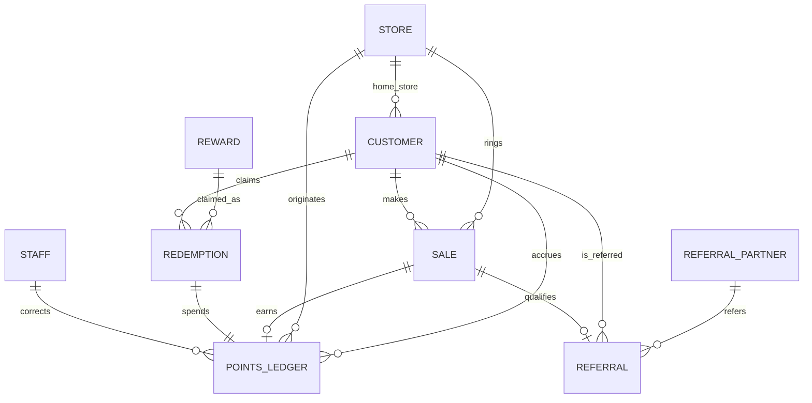

# Database schema — how to design it

**Updated:** 2026-08-11  
**Status:** Method + starter model. Not migration SQL yet.

Goal: a relational schema that is **hard to corrupt** and **easy to fix** when staff or imports get something wrong.

---

## What we know from the TapMango export

File: `~/Downloads/tapmango_customer_list_report.csv`

| Fact | Value |
|---|---|
| Rows | ~196,590 |
| Columns | 19 (no `Wallet Balance` in this file) |
| Empty phones | 58 |
| Duplicate phones (non-empty) | 0 |
| Locations | 6 names — 4 Lux stores + `Hairway 2 Heaven` + `Hollywood Beauty` |

Columns present:

`CustomerId`, `Name`, `Email`, `Phone`, `Points`, `Lifetime Points`, `Has Mobile App?`, `Registration Date/Time`, `Last Checkin Date/Time`, `Location`, `Device`, `Notes`, `Date OF Birth`, `Year OF Birth`, `Subscribed To Emails`, `Email Opt Out Date`, `Subscribed To SMS`, `SMS Opt Out Date`, `Subscribed To Push`

**Import implications:**

- Phone is the identity key going forward — normalize to E.164 (`+1…`)
- No point *history* in the export — only current `Points` (and `Lifetime Points`)
- Name is one field; new signups are phone-only (name optional / null)
- DOB columns: do not need to import for v1 unless product asks
- TapMango app/device/push flags: staging only (their app, not ours)

---

## Principles for a strong, easy-to-fix schema

### 1. Model facts you can prove, not UI screens

Derive tables from **events and identities**, not from TapMango menu names.

| Domain fact | Table idea |
|---|---|
| A person in the program | `customer` |
| A physical store | `store` |
| Points moved | `points_ledger` (append-only) |
| A Lightspeed sale we ingested | `sale` / `transaction` |
| A reward definition | `reward` |
| Someone spent points on a reward | `redemption` |
| A beautician in the program | `referral_partner` |
| A referral attempt / credit | `referral` |
| Staff who can act in admin/tablet | `staff` |

If a TapMango screen has no event behind it (campaigns, playlists), it does not get a table.

### 2. Prefer append-only for money-like data

**Points are a liability.** Easy to fix means:

- **Never** `UPDATE` a past point row to “correct” it
- Insert a new row with the opposite delta (`reason = 'correction'`)
- Balance = `sum(delta)` (view or materialized later if needed)

Staff UI can *look* like an edit; the database always records a correction. That is what makes disputes and accounting solvable.

### 3. One identity key — phone

- Store `phone` as E.164, `unique`
- `legacy_tapmango_id` kept for migration traceability
- Changing phone later = merge flow, not a casual field edit

### 4. Enforce invariants in the database

Application bugs happen. Put the load-bearing rules in Postgres:

- `points_ledger.delta <> 0`
- No `UPDATE`/`DELETE` on ledger (revoke + trigger)
- Unique `idempotency_key` on ledger writes (retries safe)
- Unique Lightspeed sale id on sales (webhook replay safe)
- Foreign keys everywhere that matter
- `CHECK` constraints for status enums where practical

### 5. Separate “imported truth” from “live truth”

```
staging_tapmango_customers  →  raw CSV, never edited
         ↓
   normalize / validate
         ↓
customer + points_ledger (migration_opening)
```

If import is wrong, re-run from staging. Do not hand-edit 200k production rows.

### 6. Keep the schema thin; add tables when behavior appears

v1 does **not** need: tiers, punch cards, campaign builders, gift cards, product-level earn catalogs — unless the client confirms they use them.

Referrals need tables now (core product). Anti-abuse can start as columns + flags, then grow.

### 7. Make “who did this?” first-class

Every manual ledger entry needs `created_by` → `staff`.  
Without `staff`, admin “corrections” are not auditable — and audits are how you *fix* trust issues.

---

## Method (do this in order)

```
1. Freeze domain list (above) — what exists in the real world
2. Map export columns → customer + opening ledger only
3. Write invariants for points (append-only, balance = sum)
4. Add sales ingestion shape (Lightspeed ids, store, amounts)
5. Add rewards + redemptions
6. Add referral partner + referral (+ token if QR)
7. Add staff + RLS roles
8. Only then: indexes, views, RPCs (redeem/award)
9. Load staging CSV, dry-run import, reconcile Points totals per store
```

Do **not** start by drawing 30 tables. Start with customer + ledger + store; prove import; then grow.

---

## Starter relational model (v1)



### Core columns (intent, not final SQL)

**`store`**  
`id`, `name`, `lightspeed_location_id`, `active`

**`customer`**  
`id`, `phone` (unique, E.164), `name` (nullable), `email` (nullable),  
`sms_subscribed`, `sms_opt_out_at`, `email_subscribed`, `email_opt_out_at`,  
`home_store_id`, `registered_at`, `last_seen_at`,  
`lifetime_points_at_migration`, `legacy_tapmango_id` (unique),  
`source` (`migration` | `tablet` | `app` | …), `created_at`

**`points_ledger`** (source of truth for balances)  
`id`, `customer_id`, `store_id` (nullable for system),  
`delta` (int, ≠ 0),  
`reason` (`earn` | `redemption` | `migration_opening` | `correction` | `referral_bonus` | …),  
`ref_type`, `ref_id`,  
`idempotency_key` (unique),  
`created_by` (staff, nullable), `created_at`  
→ **append-only**

**`sale`** (Lightspeed ingest)  
`id`, `store_id`, `customer_id` (nullable if anonymous),  
`lightspeed_sale_id` (unique), `total_cents`, `eligible_cents`, `occurred_at`

**`reward`** / **`redemption`**  
Config + spend records; redemption always creates a negative ledger row in the same transaction

**`referral_partner`** / **`referral`**  
Partner (beautician) linked to their own `customer_id` (blocks self-referral);  
referral is an **event on a visit**, not a one-time property of the customer account

**`staff`**  
Admin/tablet actors for `created_by` and RLS

**Balance:** view `customer_balance` = `sum(delta) group by customer_id` (`security_invoker`).

---

## Export → schema map

| TapMango column | Destination |
|---|---|
| `CustomerId` | `customer.legacy_tapmango_id` + idempotency `import:{id}` |
| `Phone` | `customer.phone` (E.164) |
| `Name` | `customer.name` (keep single field) |
| `Email` | `customer.email` |
| `Points` | one `points_ledger` row, `reason = migration_opening` |
| `Lifetime Points` | `customer.lifetime_points_at_migration` (reconcile aid) |
| `Location` | map name → `store.id` → `home_store_id` |
| `Registration Date/Time` | `registered_at` |
| `Last Checkin Date/Time` | `last_seen_at` |
| SMS / Email subscribe + opt-out | consent columns |
| `Has Mobile App?`, `Device`, `Subscribed To Push` | staging only |
| `Notes`, DOB | staging / skip unless needed |
| Empty phone rows (58) | quarantine table — do not invent phones |

---

## What makes it “easy to fix” in practice

| Problem | Fix path |
|---|---|
| Wrong balance | Insert correction ledger row; history shows who/when/why |
| Duplicate import | `idempotency_key` / `legacy_tapmango_id` unique → no double opening balance |
| Replay Lightspeed webhook | `lightspeed_sale_id` unique → no double earn |
| Bad migration | Truncate live import targets; re-run from untouched staging |
| Referral fraud later | Status + hold window on `referral`; flag rows — don’t delete history |
| Phone change | Explicit merge procedure writing ledger compensation |

---

## Decisions still needed before final SQL

| Topic | Why it shapes schema |
|---|---|
| Earn rate / exclusions / returns | Columns on `sale` and ledger `reason`s |
| Referral economics + hold/return window | `referral` status machine |
| Referral cross-check | Extra tables vs flags on `referral` |
| Whether beautician “points” are same ledger currency as customer points | Same `points_ledger` vs separate wallet |
| Staff roles | RLS policies |

Architecture: Lightspeed **X-Series** confirmed (`sale.update` webhooks). Still open: dual-tablet split, PITR after pilot, referral cross-check, earn/return rules.

---

## Recommended next step

1. Copy CSV into the repo as `data/tapmango/` (or keep outside git if sensitive) and add `staging` migration  
2. Write Supabase migration `001` with: `store`, `customer`, `points_ledger`, `staff`, balance view, append-only triggers  
3. Dry-run import → reconcile `sum(points)` vs TapMango per location  
4. Add `sale` / rewards / referrals in migrations `002+`

Say when you want to draft the actual SQL migrations.
